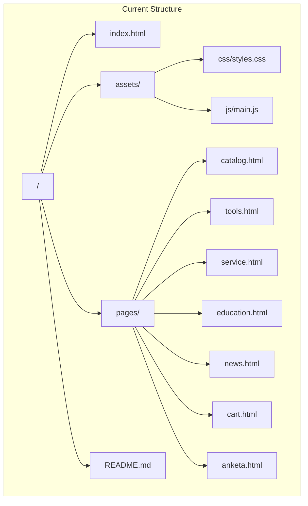
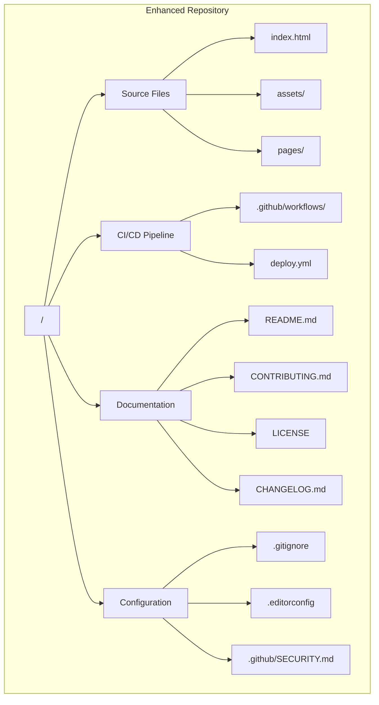
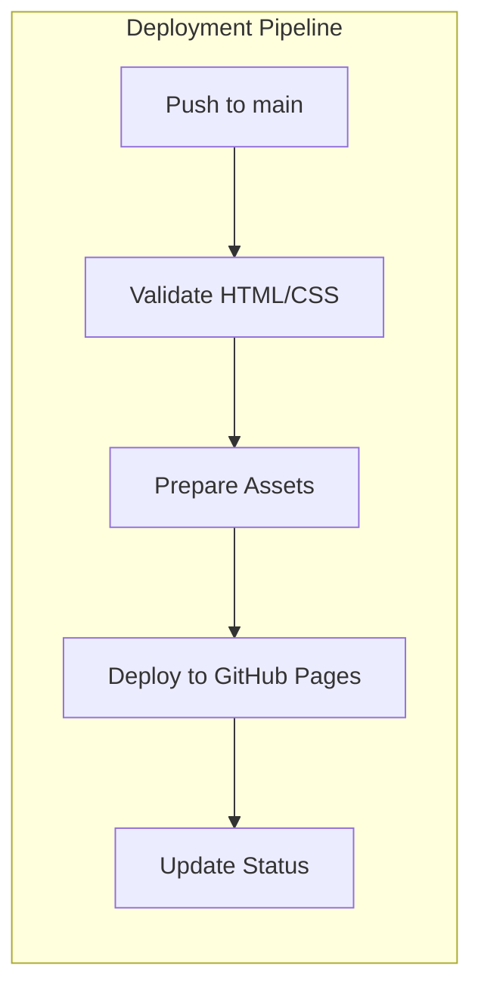
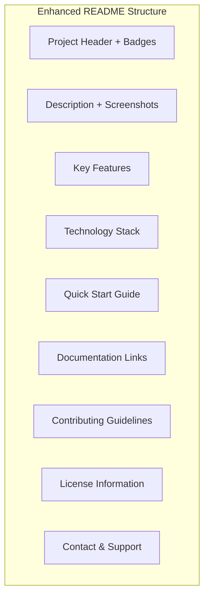
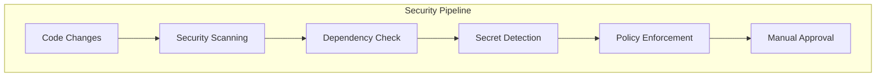
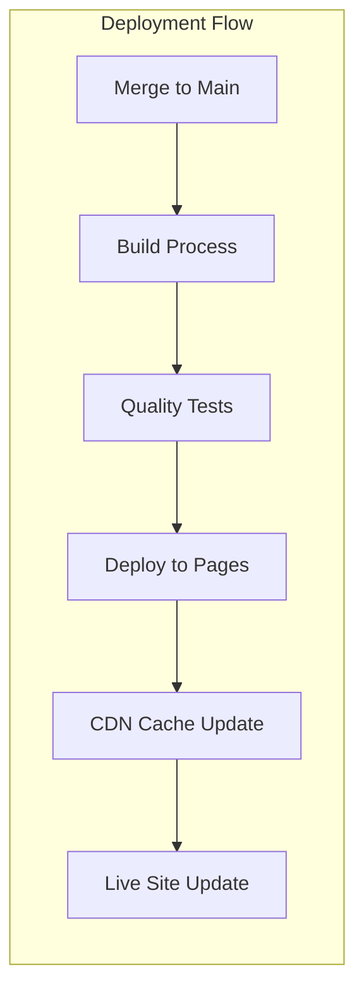
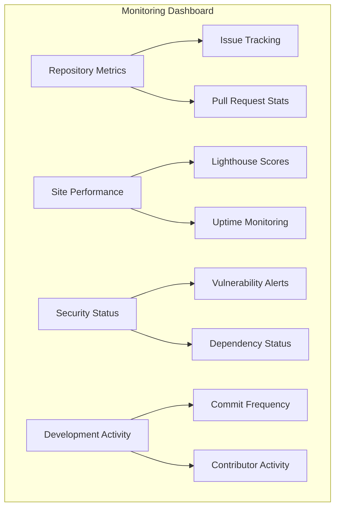
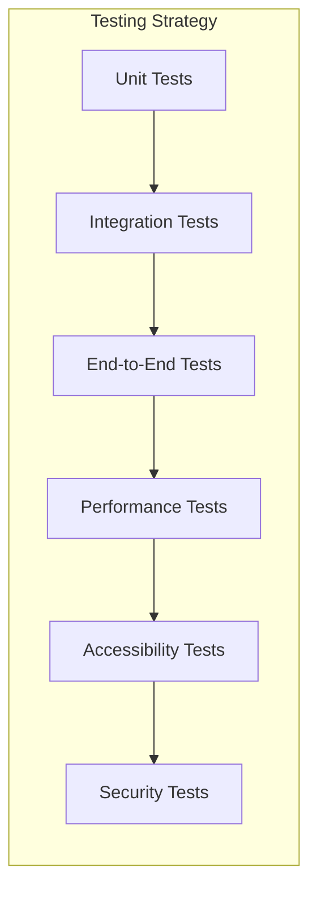

# GitHub Repository Update Design

## Overview

This design outlines the comprehensive update strategy for the Aksta.site GitHub repository, focusing on modern repository management practices, automated deployment, and enhanced collaboration workflows. The goal is to transform the current static website project into a well-structured, maintainable, and professionally managed GitHub repository.

## Repository Type Detection

**Repository Type**: Frontend Application (Static Website)
- Corporate website for ООО «АКСТА» metalworking equipment supplier
- Pure HTML/CSS/JavaScript stack without build tools
- Static hosting compatible structure
- Multi-page application with shared assets

## Architecture

### Current Repository Structure


### Enhanced Repository Architecture


## Repository Enhancement Components

### 1. File Structure Improvements

#### Essential Files to Add
```
.github/
├── workflows/
│   ├── deploy.yml          # GitHub Pages deployment
│   ├── code-quality.yml    # Linting and validation
│   └── security.yml        # Security scanning
├── ISSUE_TEMPLATE/
│   ├── bug_report.md       # Bug report template
│   ├── feature_request.md  # Feature request template
│   └── question.md         # Question template
├── PULL_REQUEST_TEMPLATE.md
├── SECURITY.md             # Security policy
└── FUNDING.yml             # Sponsorship info (optional)

docs/
├── CONTRIBUTING.md         # Contribution guidelines
├── CODE_OF_CONDUCT.md      # Code of conduct
├── DEPLOYMENT.md           # Deployment instructions
└── DEVELOPMENT.md          # Development setup guide

.editorconfig               # Editor configuration
.gitignore                  # Git ignore rules
LICENSE                     # Project license
CHANGELOG.md               # Version history
```

#### Configuration Files Content

**.gitignore**
```
# Development
.vscode/
.idea/
*.log
*.tmp

# OS generated files
.DS_Store
.DS_Store?
._*
.Spotlight-V100
.Trashes
ehthumbs.db
Thumbs.db

# Backup files
*.bak
*~

# Local server files
node_modules/
dist/
.cache/
```

**.editorconfig**
```
root = true

[*]
charset = utf-8
end_of_line = lf
insert_final_newline = true
trim_trailing_whitespace = true
indent_style = space
indent_size = 2

[*.{html,css,js}]
indent_size = 2

[*.md]
trim_trailing_whitespace = false
```

### 2. GitHub Actions Workflows

#### Deployment Workflow


**deploy.yml Structure:**
- Trigger on push to main branch
- HTML validation using W3C validator
- CSS validation and linting
- JavaScript linting with ESLint
- Accessibility testing with axe-core
- Deploy to GitHub Pages
- Performance testing with Lighthouse CI

#### Code Quality Workflow
- HTML validation
- CSS validation with stylelint
- JavaScript linting with ESLint
- Accessibility compliance checking
- Link checking for broken links
- Image optimization validation

### 3. Documentation Enhancement

#### README.md Improvements


**Key additions:**
- Status badges (build, deployment, license)
- Live demo links
- Screenshot gallery
- Feature highlights with icons
- Browser compatibility matrix
- Performance metrics
- Contribution guidelines link

#### CONTRIBUTING.md Structure
- Development environment setup
- Code style guidelines
- Commit message conventions
- Pull request process
- Issue reporting guidelines
- Testing requirements
- Documentation standards

### 4. Branch Management Strategy

#### Branch Structure
```mermaid
gitgraph
    commit id: "Initial"
    branch develop
    checkout develop
    commit id: "Feature 1"
    commit id: "Feature 2"
    checkout main
    merge develop
    commit id: "Release v1.1"
    branch hotfix
    checkout hotfix
    commit id: "Critical Fix"
    checkout main
    merge hotfix
    commit id: "Hotfix v1.1.1"
```

**Branch Types:**
- `main`: Production-ready code
- `develop`: Integration branch for features
- `feature/*`: Individual feature branches
- `hotfix/*`: Critical production fixes
- `release/*`: Release preparation branches

#### Git Workflow Rules
- Protected main branch
- Required pull request reviews
- Status checks must pass
- No direct commits to main
- Squash merge for features
- Semantic versioning tags

### 5. Security and Quality Gates

#### Security Measures


**Security Components:**
- CodeQL analysis for vulnerability detection
- Dependabot for dependency updates
- Secret scanning for exposed credentials
- Security policy documentation
- Automated security advisories

#### Quality Gates
- HTML validation (W3C)
- CSS validation and linting
- JavaScript code quality (ESLint)
- Accessibility compliance (WCAG 2.1)
- Performance benchmarks (Lighthouse)
- Link integrity checking

### 6. Deployment and Hosting

#### GitHub Pages Configuration


**Deployment Features:**
- Automatic deployment on main branch updates
- Custom domain support (aksta.site)
- HTTPS enforcement
- CDN integration for performance
- Rollback capabilities
- Deployment status notifications

#### Environment Configuration
- Production: GitHub Pages
- Staging: GitHub Pages (separate repo/branch)
- Development: Local server setup
- Testing: Automated testing environment

### 7. Monitoring and Analytics

#### Repository Health Monitoring


**Monitoring Components:**
- GitHub Insights for repository analytics
- Lighthouse CI for performance monitoring
- Security advisory notifications
- Dependency vulnerability tracking
- Custom badges for status display

## Testing Strategy

### Automated Testing Pipeline


### Testing Framework Integration
- **HTML Validation**: W3C Markup Validator
- **CSS Testing**: stylelint for code quality
- **JavaScript Testing**: ESLint + Jest for unit tests
- **Accessibility Testing**: axe-core automated testing
- **Performance Testing**: Lighthouse CI integration
- **Cross-browser Testing**: Playwright or Cypress
- **Visual Regression**: Percy or Chromatic integration

### Test Automation Workflow
1. **Pre-commit Hooks**: Local validation before commit
2. **Pull Request Tests**: Full test suite on PR creation
3. **Deployment Tests**: Production environment validation
4. **Scheduled Tests**: Regular health checks
5. **Manual Testing**: Critical path verification

## Implementation Roadmap

### Phase 1: Repository Foundation (Week 1)
- Set up enhanced file structure
- Configure .gitignore and .editorconfig
- Create basic GitHub Actions workflows
- Update README.md with comprehensive documentation
- Implement branch protection rules

### Phase 2: Automation Pipeline (Week 2)
- Deploy GitHub Pages automation
- Set up code quality workflows
- Configure security scanning
- Implement testing automation
- Create issue and PR templates

### Phase 3: Documentation and Guidelines (Week 3)
- Create CONTRIBUTING.md guidelines
- Set up SECURITY.md policy
- Document deployment procedures
- Create development setup guide
- Implement changelog automation

### Phase 4: Monitoring and Optimization (Week 4)
- Set up performance monitoring
- Configure status badges
- Implement analytics tracking
- Optimize deployment pipeline
- Create maintenance procedures

## Risk Assessment and Mitigation

### Technical Risks
| Risk | Impact | Probability | Mitigation |
|------|---------|------------|------------|
| Deployment failures | High | Low | Automated rollback + staging environment |
| Security vulnerabilities | High | Medium | Automated scanning + dependency updates |
| Performance degradation | Medium | Low | Lighthouse monitoring + optimization alerts |
| Broken dependencies | Medium | Medium | Dependabot automation + testing |
| Configuration errors | Medium | Low | Validation workflows + peer review |

### Operational Risks
| Risk | Impact | Probability | Mitigation |
|------|---------|------------|------------|
| Accidental main branch changes | High | Low | Branch protection + required reviews |
| Loss of historical data | High | Very Low | Repository backup + Git history preservation |
| Access management issues | Medium | Low | Clear permission documentation + audit logs |
| Workflow disruption | Medium | Low | Gradual rollout + training documentation |