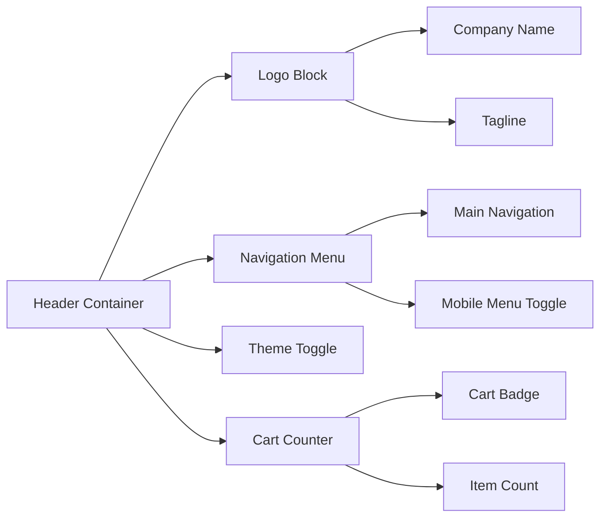
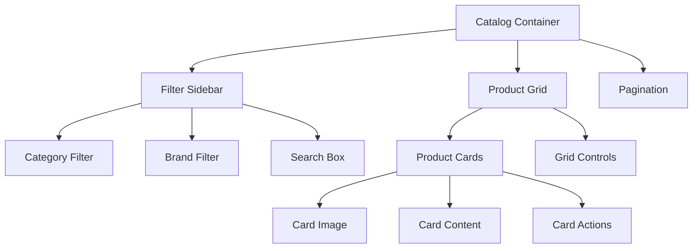
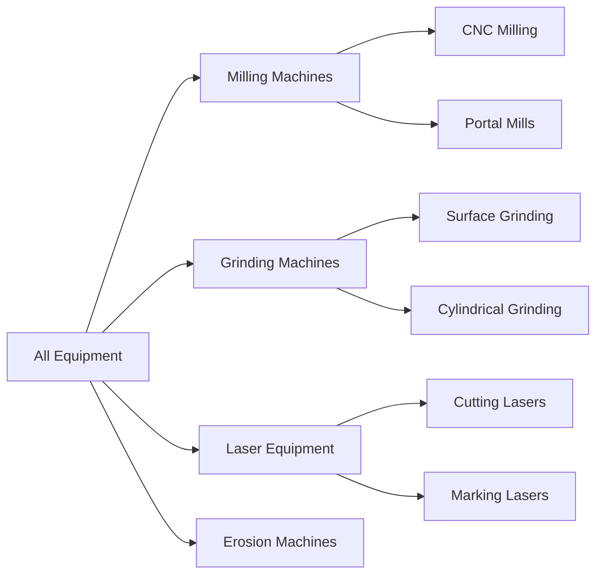

# Website Catalog Layout Design

## Overview

This design document outlines improvements for the Aksta.site corporate website, focusing on enhancing the visual design and creating a beautiful, functional catalog layout. The goal is to transform the current basic catalog structure into an engaging, modern interface that better showcases metalworking equipment and tools while maintaining the existing technical foundation.

### Current State Analysis

The existing website features:
- Static HTML/CSS/JS architecture with 7 main pages
- Basic catalog page with simple card layout (7 equipment brands)
- Pink-gray color scheme (#e97eb2 accent) with dark/light theme support
- Mobile-first responsive design
- localStorage-based cart functionality
- Russian language content for industrial B2B audience

### Design Goals

1. **Enhanced Visual Hierarchy**: Create clear information organization and visual flow
2. **Modern Catalog Layout**: Transform basic cards into engaging product showcases
3. **Improved User Experience**: Streamline navigation and product discovery
4. **Professional Branding**: Reinforce industrial B2B credibility
5. **Performance Optimization**: Maintain fast loading while enhancing aesthetics

## Technology Stack & Dependencies

The design will build upon the existing technology foundation:

**Core Technologies:**
- HTML5 semantic structure
- CSS3 with CSS Variables for theming
- Vanilla JavaScript (ES6+)
- No external frameworks or libraries

**Design System:**
- CSS Grid and Flexbox for layouts
- CSS Custom Properties for consistent theming
- CSS Transitions for smooth interactions
- Media queries for responsive behavior

**Browser Compatibility:**
- Modern browsers (Chrome, Firefox, Edge, Safari)
- Progressive enhancement approach
- Fallbacks for CSS Grid in older browsers

## Component Architecture

### Enhanced Header Component



**Enhanced Features:**
- Sticky header behavior with scroll-based styling
- Improved mobile navigation with hamburger menu
- Enhanced cart counter with visual feedback
- Logo with subtle animation effects

### Catalog Layout System

#### Grid-Based Layout Architecture



#### Product Card Components

**Card Structure:**
- Hero image or equipment visualization
- Brand logo/badge
- Equipment name and category
- Key specifications snippet
- Price/inquiry call-to-action
- "Add to Cart" functionality

#### Responsive Grid Behavior

| Screen Size | Columns | Card Width | Sidebar |
|-------------|---------|------------|---------|
| Mobile (≤768px) | 1 | Full width | Collapsed |
| Tablet (769-1024px) | 2 | ~45% | Overlay |
| Desktop (≥1025px) | 3-4 | ~25-30% | Fixed |

### Advanced Catalog Features

#### Category Navigation System



#### Filter and Search System

**Filter Categories:**
- Equipment Type (Dropdown)
- Brand/Manufacturer (Checkbox list)
- Price Range (Slider - for inquiry ranges)
- Availability Status
- New/Used condition

**Search Functionality:**
- Real-time search with debouncing
- Search in titles, descriptions, specifications
- Search history with localStorage
- Autocomplete suggestions

#### Product Detail Enhancement

**Expanded Card Information:**
- High-quality equipment images
- Technical specifications table
- Key features highlight list
- Manufacturer information
- Related equipment suggestions
- Quick inquiry form

### Visual Design Enhancements

#### Color Scheme Evolution

**Primary Palette:**
- Primary: #e97eb2 (existing pink accent)
- Primary Dark: #b84d8b
- Secondary: #2c3e50 (industrial blue-gray)
- Success: #27ae60 (availability indicators)
- Warning: #f39c12 (attention items)
- Error: #e74c3c (out of stock)

**Extended Palette:**
- Background Neutral: #f8f9fa
- Card Background: #ffffff
- Border Color: #dee2e6
- Text Primary: #212529
- Text Secondary: #6c757d

#### Typography Hierarchy

**Font System:**
- Primary: 'Segoe UI', system-ui, sans-serif
- Headings: Bold weights (600-700)
- Body: Regular weight (400)
- Captions: Light weight (300)

**Type Scale:**
- H1 (Page titles): 2.5rem
- H2 (Section headers): 2rem
- H3 (Card titles): 1.5rem
- Body: 1rem
- Small: 0.875rem

#### Spacing and Layout

**Spacing System:**
- Base unit: 8px
- Micro: 4px (0.25rem)
- Small: 8px (0.5rem)
- Medium: 16px (1rem)
- Large: 24px (1.5rem)
- XL: 32px (2rem)
- XXL: 48px (3rem)

### Interactive Elements

#### Enhanced Card Interactions

**Hover States:**
- Subtle scale transformation (1.02x)
- Box shadow enhancement
- Color accent reveals
- Image zoom effects

**Card Actions:**
- Quick view modal
- Add to cart with animation
- Share functionality
- Bookmark/save for later

#### Micro-Interactions

**Button Animations:**
- Ripple effects on click
- Loading states for async actions
- Success/error feedback animations
- Disabled state transitions

**Form Enhancements:**
- Floating labels
- Real-time validation
- Progress indicators
- Success confirmations

### State Management Enhancement

#### Cart System Improvements

**Enhanced Cart Data Structure:**
```javascript
{
  id: 'unique-id',
  equipment: {
    name: 'Equipment Name',
    brand: 'Manufacturer',
    model: 'Model Number',
    category: 'Equipment Type',
    image: 'image-url',
    specifications: {...}
  },
  quantity: 1,
  notes: 'Customer notes',
  dateAdded: 'timestamp',
  priority: 'normal|urgent'
}
```

#### Filter State Management

**URL State Synchronization:**
- Filter parameters in URL queries
- Browser back/forward support
- Shareable filtered views
- Bookmark-friendly URLs

### Testing Strategy

#### Visual Testing

**Cross-browser Testing:**
- Chrome, Firefox, Edge, Safari
- Mobile browsers (iOS Safari, Chrome Mobile)
- Tablet landscape/portrait orientations

**Responsive Testing:**
- iPhone 12/13/14 series
- iPad and iPad Pro
- Common Android devices
- Desktop resolutions (1920x1080, 2560x1440)

#### Performance Testing

**Metrics to Monitor:**
- First Contentful Paint (FCP) < 1.5s
- Largest Contentful Paint (LCP) < 2.5s
- Cumulative Layout Shift (CLS) < 0.1
- First Input Delay (FID) < 100ms

#### Accessibility Testing

**WCAG 2.1 Compliance:**
- Keyboard navigation
- Screen reader compatibility
- Color contrast ratios (AA level)
- Focus management
- Alternative text for images

### Performance Considerations

#### Image Optimization

**Image Strategy:**
- WebP format with JPEG fallbacks
- Responsive image sets with srcset
- Lazy loading implementation
- Optimized file sizes (<100KB per image)

#### CSS Optimization

**Performance Techniques:**
- Critical CSS inlining
- CSS custom properties for dynamic theming
- Minimal animation usage
- Efficient selector specificity

#### JavaScript Optimization

**Code Organization:**
- Modular function structure
- Event delegation patterns
- Debounced search/filter functions
- Lazy loading for non-critical features

### Implementation Phases

#### Phase 1: Foundation Enhancement (Week 1-2)
- Enhanced CSS variables and color system
- Improved typography and spacing
- Basic grid layout implementation
- Mobile-first responsive improvements

#### Phase 2: Catalog Core Features (Week 3-4)
- Advanced product card design
- Filter and search functionality
- Category navigation system
- Enhanced cart interactions

#### Phase 3: Advanced Features (Week 5-6)
- Micro-interactions and animations
- Advanced state management
- Performance optimizations
- Cross-browser testing and fixes

#### Phase 4: Polish & Launch (Week 7-8)
- Accessibility audit and fixes
- Performance optimization
- User testing and feedback integration
- Documentation and deployment

### Browser Support Matrix

| Browser | Version | Support Level | Notes |
|---------|---------|---------------|--------|
| Chrome | 88+ | Full | Primary development target |
| Firefox | 85+ | Full | CSS Grid and variables support |
| Safari | 14+ | Full | WebKit-specific prefixes |
| Edge | 88+ | Full | Chromium-based versions |
| IE 11 | - | Graceful degradation | Basic layout, no advanced features |

### Risk Assessment

#### Technical Risks
- **CSS Grid Fallbacks**: Ensure flexbox alternatives for older browsers
- **JavaScript Dependencies**: Maintain vanilla JS approach to avoid dependency issues
- **Performance Impact**: Monitor file size increases with enhanced features

#### Design Risks
- **Brand Consistency**: Ensure industrial aesthetic alignment
- **User Adaptation**: Gradual introduction of new features
- **Content Management**: Plan for easy content updates without technical knowledge

#### Mitigation Strategies
- Progressive enhancement approach
- Comprehensive testing across devices
- User feedback collection mechanisms
- Documentation for future maintenance